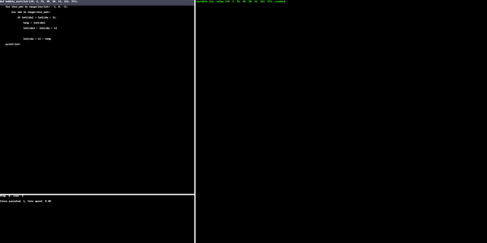

# TDebugger
A advanced python debugger with live tracing
## Installation
Use the `pip` package manager to install TDebugger
```shell script
pip install TDebugger
```
Then, you can run it as a command-line tool:
```shell script
TDebugger.py --help
```

## Output:



Moving to CCextracter.
